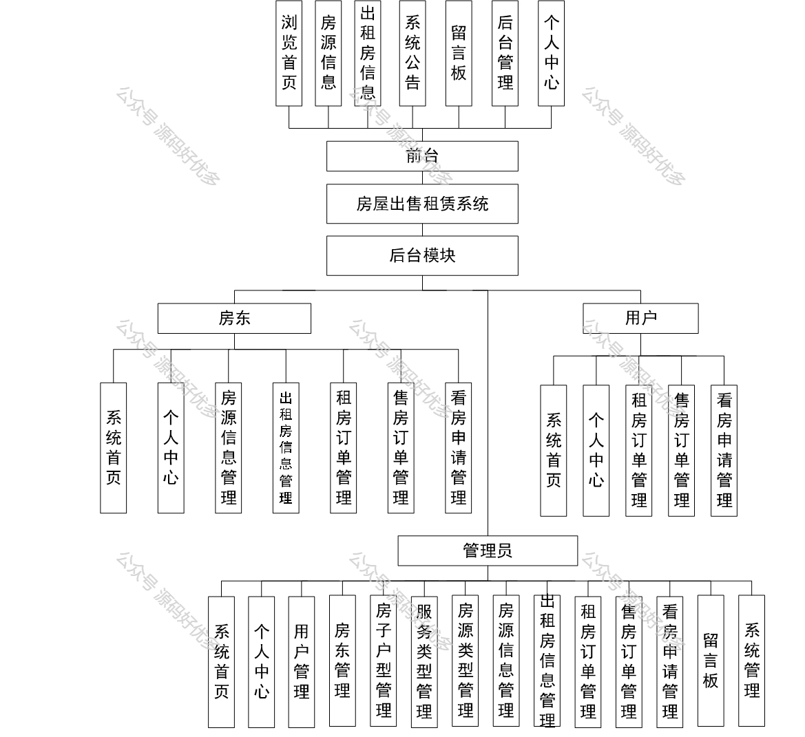
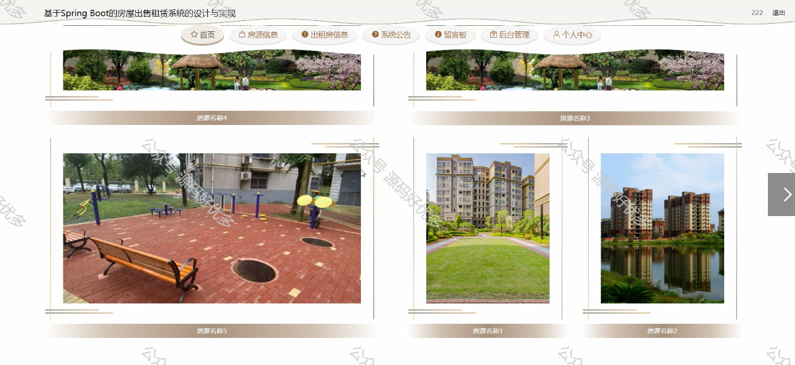
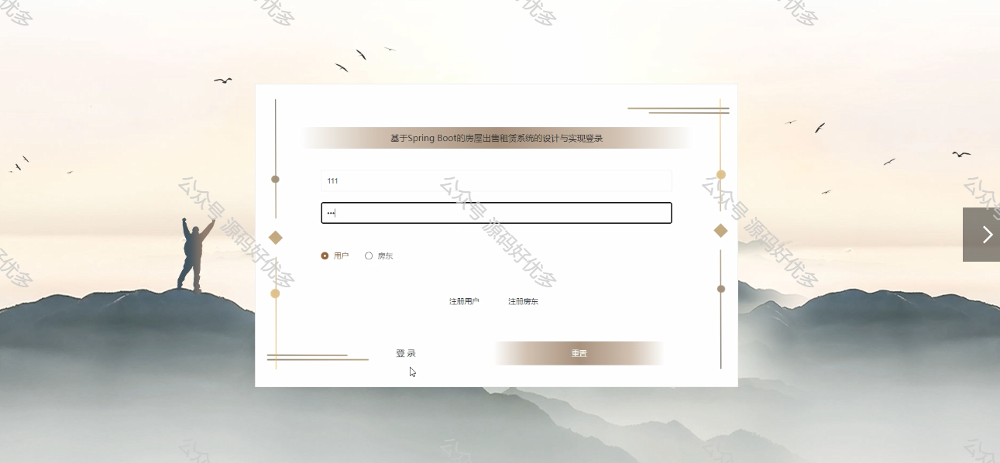
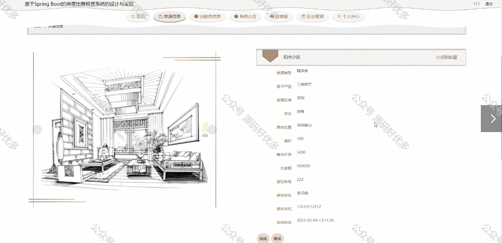
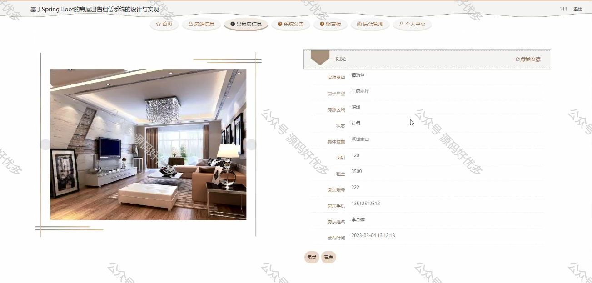
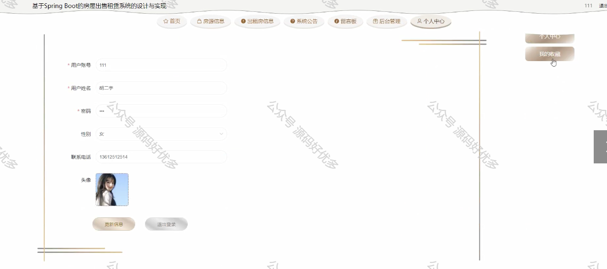
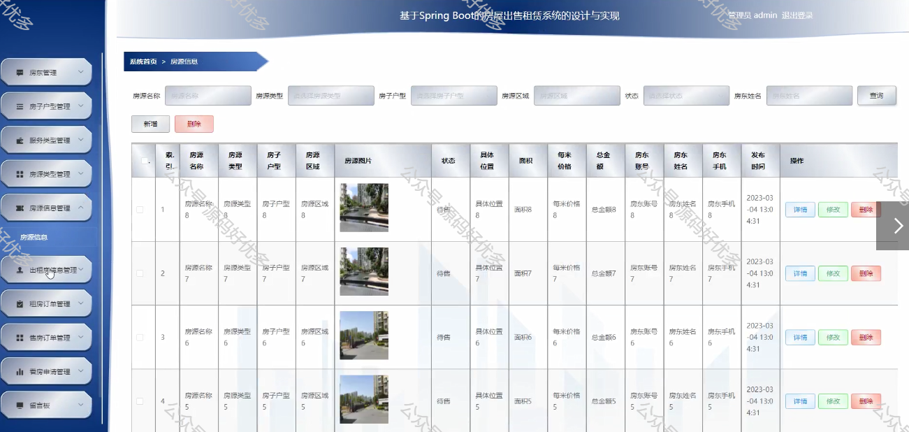
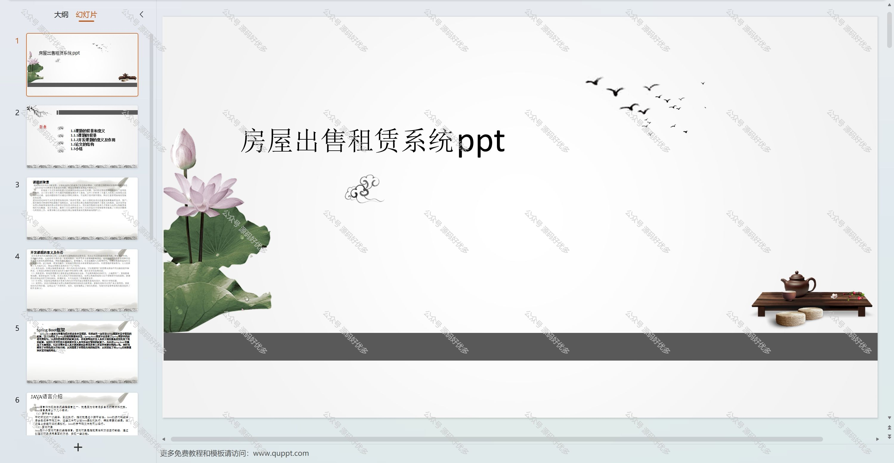
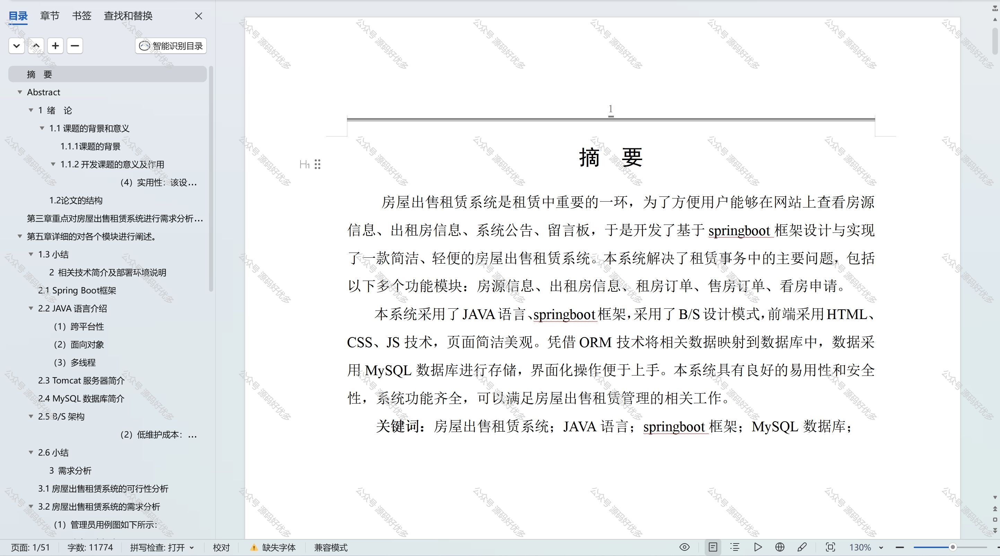

# springbootA319
springbootA319房屋出售租赁系统LW+PPT
 
## 查看主页获取源码

### 一、作品包含

源码+数据库+设计文档万字+PPT+全套环境和工具资源+部署教程

### 二、项目技术

前端技术：Html、Css、Js、Vue、Element-ui

数据库：MySQL

后端技术：Java、Spring Boot、MyBatis

  

### 三、运行环境

开发工具：IDEA/eclipse

数据库：MySQL5.7

数据库管理工具：Navicat10以上版本

环境配置软件： JDK1.8+Maven3.6.3

前端Nodejs：14

### 四、项目介绍
项目编号：springbootA319

房屋出售租赁系统是一款集房源信息发布、房源查询、在线交易等功能于一体的在线服务平台。该系统旨在为房东和租户提供一个便捷、安全、高效的房产交易环境。背景是随着房地产市场的快速发展，人们对于房屋买卖和租赁的需求日益增长，传统的找房方式已无法满足现代人的需求，因此，房屋出售租赁系统的出现，极大地简化了房产交易流程，提高了交易效率。

前台用户功能：浏览首页、房源信息、出租房信息、系统公告、留言板、后台管理、个人中心。

后台分为管理员、用户、房东
管理员的功能：系统首页、个人中心、用户管理、房东管理、房子户型管理、服务类型管理、房源类型管理、房源信息管理、出租房信息管理、租房订单管理、售房订单管理、看房申请管理、留言板、系统管理。
用户的功能：系统首页、个人中心、租房订单管理、售房订单管理、看房申请管理。
房东的功能：系统首页、个人中心、房源信息管理、出租房信息管理、租房订单管理、售房订单管理、看房申请管理。

### 五、运行截图

  
